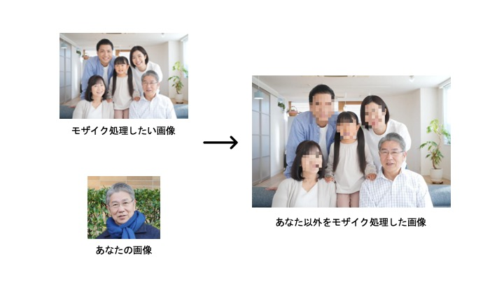

# あなた以外をモザイク処理するAIアプリ

## かんたんな説明

何かとプライバシーに気を使わないといけない現代．

SNSに写真をアップするとき，他の人の顔をモザイク処理したいけど，自分の顔は見せたい．そんなときありませんか？
AIの力を使って，画像の中からあなたの顔を認識し，あなた以外の顔をモザイク処理します！これで，めんどくさいモザイク処理からはおさらばだ！

[こちら](https://mosaic-ai.streamlit.app/)からぜひ試してみてください！

<figure>
  
  <center>
  <figcaption>イメージ図</figcaption>
</figure>

## 詳しい説明

このアプリは，Python．[Face-Recognition API](https://github.com/ageitgey/face_recognition)，Streamlitフレームワークを使用して構築されたモザイク処理アプリです．
このアプリは，アップロードされた写真から特定の人物以外の顔にモザイク処理を施します．
face_recognitionライブラリによって埋め込み表現を計算し，その類似性を求めることで顔認識を行っています．
モザイク処理後の画像はダウンロードが可能です．
以下でローカルでのインストール方法，実行方法を示していますが，Streamlit cloud上でお手軽に実行もできます．

URL: https://mosaic-ai.streamlit.app/


### 用途

- SNSに他人の写真をアップする際のプライバシー保護

### 機能


- 人間の顔の検知と認識
- 複数の人間が含まれる画像に対応
- 特定の人物を除いたモザイク処理
- わかりやすいUI

### 要件
ローカルで実行する際には，以下の要件が必要です．

- Ubuntu 22.04.4 LTS
- Python 3.10.0
- face_recognition
- streamlit==1.33.0
- opencv-python

### インストールと実行手順

1. リポジトリをクローン
```
git clone git@github.com:junya737/mosaic-ai.git
cd mosaic-ai
```

2. conda環境と必要なライブラリの導入
```
conda env create -f /environment/environment.yml
```

3. アプリを実行
```
cd scripts
streamlit run frontend.py
```
これを実行すると，Network URLが得られるので，それをお使いのブラウザに入力するとアプリを実行できます．

#### 連絡先
何かご要件，ご要望があれば以下まで．

junyaihira[@]gmail.com


